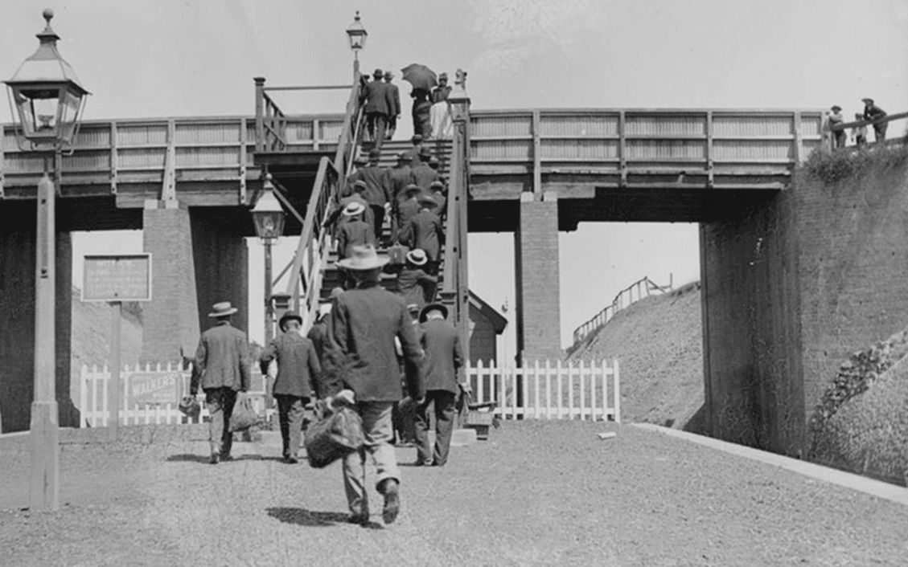

# Love GranniE — Down under CTF 2025 (OSINT)

[← Back to DUC CTF 2025](../ctf-duc-2025.md)

Category: OSINT

Points:

Author: a_metre

## Description

Dear Brunnerne,

Hello dear, it's your Grannie E.

My lovely nurse took me out today and I found where I used to go see movies! Back in my day movies didn't talk or have sound! How the times have changed. I've added in a photo from back when I used to live there, with help from my nurse.

I'm going for a cuppa now, will call later.

Love,
Grannie E.

Handout:

## Summary and solution

This picture is from Epping railway station in 1920. After googling, we found a nearby cinema.
https://cinematreasures.org/theaters/40752

## ✅ Final Flag

    DUCTF{TheCambria_47BeecroftRd_Epping}
