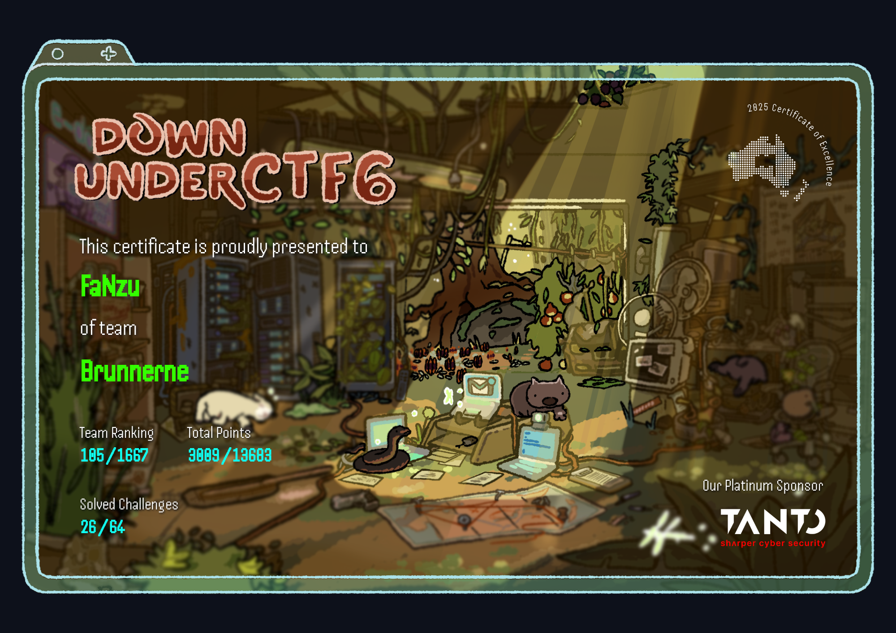

# Down under CTF 2025

Nicely arranged ctf, from Down under

I competed as part of [Brunnerne](https://brunnerne.dk) :D
This Writeup is a compilation of my own and teammembers effort, explained by a noob. Doing this is try and explore the different categories i normally dont touch.

For this, we competed with:
- Ha1fdan
- FaNzu (me)
- Migsej
- Themikkel
- 0xjeppe
- H4N5
- Quack
- DaWiz
- Nissen
- HLVM
- a few more giving advice along the way :D

Certificate: 

## Challenges by Category

_note: after the ctf is competed the handout might not work I have uploaded these that made sense. Also, any url with -us, the AU was the same url just without._

### Beginner
- [Discord](Beginner/discord.md)
- [Zeus](Beginner/zeus.md)
- [Kick the bucket](Beginner/kick_the_bucket.md)
- [Philtered](Beginner/philtered.md)
- [Corporate cliche](Beginner/corporate_cliche.md)
- [Our lonely dog](Beginner/our_lonely_dog.md)
- [Secure email attachments](Beginner/secure_email_attachments.md)
- [Down To Modulate Frequencies!](Beginner/down_to-modulate_frequencies.md)
- [Stonks](Beginner/stonks.md)
- [Hungry hungry caterpillar](Beginner/hungry-hungry-caterpillar.md)
- [Horoscopes.md](Beginner/horoscopes.md) <- my favorite chal
- [wiki](Beginner/wiki.md) <- part 2 of my favorite chal :D
- trusted <- part 3 of my favorite chal, never finished this.

### PWN

### Crypto

### WEB

- mini.me
- gomail

### REV

- Rocky

### AI

- ductfbank 1
- ductfbank 2

### OSINT

- [Yippee](OSINT/yippee.md)
- [Love GranniE](OSINT/love_granni_e.md)
- [fat donke diss](OSINT/fat_donke_diss.md)

### MISC

- Fishe website
- yodawg
- mary had a little lambda
- scrapbooking
- beepbeep

## Event Details
- Date: July 12–13, 2025
- Team: Brunnerne
- Format: Jeopardy