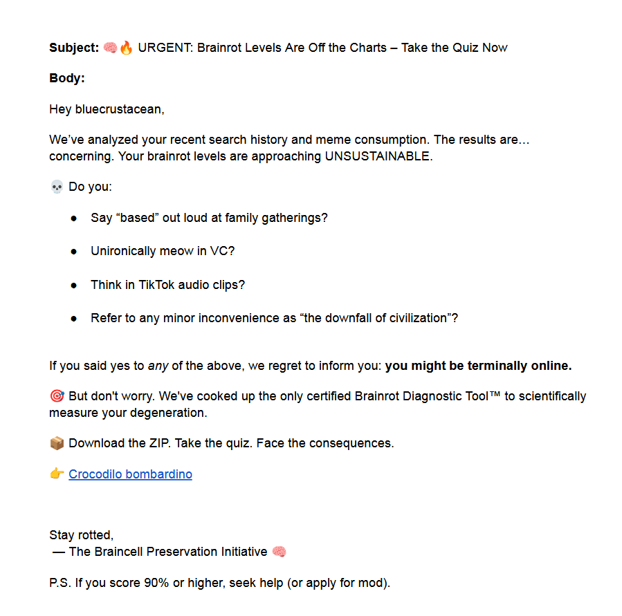

# Bombardino crocodile (FORENSICS) - L3AK CTF 2025

[← Back to L3AK CTF 2025](ctf-l3ak-2025.md)

Description:
APT Lobster has successfully breached a machine in our network, marking their first confirmed intrusion. Fortunately, the DFIR team acted quickly, isolating the compromised system and collecting several suspicious files for analysis. Among the evidence, they also recovered an outbound email sent by the attacker just before containment, I wonder who was he communicating with...The flag consists of 2 parts.

Handout: [Google Drive link](https://drive.google.com/file/d/1i8oVitzdK9RKbzbTrFgkw5ZjM7YU1SJx/view?usp=drive_link)

The handout includes copy of a Windows file system, and a eml file. Which seems to be an email of some kind, but most of the stuff inside is encoded in base64. When decoded we ended up with a text like.

Unencrypted message:

```
X-Pm-Content-Encryption: end-to-end
X-Pm-Origin: internal
Subject: Welcome to the Brotherhood...
To: bluecrustacean@proton.me <bluecrustacean@proton.me>
From: notwarlocksmurf <notwarlocksmurf@proton.me>
Date: Sat, 10 May 2025 12:24:11 +0000
Mime-Version: 1.0
Content-Type: multipart/mixed;boundary=---------------------44bd2d84e48fdc3dda289f06ba1a38cf
Message-Id: <1JOC3C4u_L37648STyXxhct-d1s8hQ559-GE50ExQkumCsJaVy2XnTmAqZXxNBoGercF1l-iQKmI8xj0H8PhZd0VVPK64B7hxtd9AJD-zlo=@proton.me>
X-Pm-Scheduled-Sent-Original-Time: Sat, 10 May 2025 12:23:59 +0000
X-Pm-Recipient-Authentication: bluecrustacean%40proton.me=pgp-pm
X-Pm-Recipient-Encryption: bluecrustacean%40proton.me=pgp-pm

-----------------------44bd2d84e48fdc3dda289f06ba1a38cf
Content-Type: multipart/related;boundary=---------------------2da309a6cdbf0642d3a70b7c2c99e2d0

-----------------------2da309a6cdbf0642d3a70b7c2c99e2d0
Content-Type: text/html;charset=utf-8
Content-Transfer-Encoding: base64

PGRpdiBzdHlsZT0iZm9udC1mYW1pbHk6IEFyaWFsLCBzYW5zLXNlcmlmOyBmb250LXNpemU6IDE0
cHg7Ij48cCBkYXRhLXN0YXJ0PSI0MDUiIGRhdGEtZW5kPSI0NDEiPjxzdHJvbmcgZGF0YS1zdGFy
dD0iNDA1IiBkYXRhLWVuZD0iNDQxIj48L3N0cm9uZz48L3A+PC9kaXY+PHAgZGF0YS1zdGFydD0i
NDM1IiBkYXRhLWVuZD0iNDU2Ij5HcmVldGluZ3MsIE9wZXJhdGl2ZS48L3A+PHAgZGF0YS1zdGFy
dD0iNDU4IiBkYXRhLWVuZD0iNTkzIj5Zb3VyIGFjdGl2aXR5IGhhcyBub3QgZ29uZSB1bm5vdGlj
ZWQuIFRoZSB0aW1lIGhhcyBjb21lIHRvIHByb2NlZWQgdG8gdGhlIG5leHQgbGV2ZWwuIEJyb3Ro
ZXJob29kIHByb3RvY29scyBkZW1hbmQgYWJzb2x1dGUgZGlzY3JldGlvbi48L3A+PHAgZGF0YS1z
dGFydD0iNTk1IiBkYXRhLWVuZD0iNjQ1Ij7wn5W277iPIEFzIG9mIDA0MDAgaG91cnMsIGFjY2Vz
cyBoYXMgYmVlbiBwcm92aXNpb25lZC48L3A+PHAgZGF0YS1zdGFydD0iNjQ3IiBkYXRhLWVuZD0i
NzM4Ij7wn5OpIFNlY3VyZSB5b3VyIGludml0ZTo8YnIgZGF0YS1zdGFydD0iNjY5IiBkYXRhLWVu
ZD0iNjcyIj4K8J+RiSA8c3Bhbj48YSB0YXJnZXQ9Il9ibGFuayIgcmVsPSJub3JlZmVycmVyIG5v
Zm9sbG93IG5vb3BlbmVyIiBocmVmPSJodHRwczovL2Rpc2NvcmQuZ2cvYTdTVXRaWGFQNCI+aHR0
cHM6Ly9kaXNjb3JkLmdnL2E3U1V0WlhhUDQ8L2E+PC9zcGFuPjwvcD48cCBkYXRhLXN0YXJ0PSI3
NDAiIGRhdGEtZW5kPSI3NjMiPkluc2lkZSB5b3Ugd2lsbCBmaW5kIGxlYWtzIG9mIHBlb3BsZSBk
dW1iIGVub3VnaCB0byBjbGljayBvbiBvdXIgYnJhaW5yb3QgZXhhbS48L3A+PGRpdiBkYXRhLXN0
YXJ0PSI3NDAiIGRhdGEtZW5kPSI3NjMiIHN0eWxlPSJmb250LWZhbWlseTogQXJpYWwsIHNhbnMt
c2VyaWY7IGZvbnQtc2l6ZTogMTRweDsgbWFyZ2luLXRvcDogMTRweDsgbWFyZ2luLWJvdHRvbTog
MTRweDsgY29sb3I6IHJnYigwLCAwLCAwKTsgYmFja2dyb3VuZC1jb2xvcjogcmdiKDI1NSwgMjU1
LCAyNTUpOyI+PHAgZGF0YS1zdGFydD0iOTU2IiBkYXRhLWVuZD0iMTAzNSI+8J+UkiBSZW1pbmRl
cjogRG8gTk9UIHNoYXJlIHRoaXMgbGluay4gT3BlcmF0aXZlcyB3aG8gbGVhayB3aWxsIGJlIGV4
aWxlZC4gQWdhaW4uPC9wPjxwIGRhdGEtc3RhcnQ9IjEwMzciIGRhdGEtZW5kPSIxMTQxIj5TdGF5
IGNsb2FrZWQuIFN0YXkgY29ycnVwdC48YnIgZGF0YS1zdGFydD0iMTA2NCIgZGF0YS1lbmQ9IjEw
NjciPjwvcD48L2Rpdj48ZGl2IGNsYXNzPSJwcm90b25tYWlsX3NpZ25hdHVyZV9ibG9jayIgc3R5
bGU9ImZvbnQtZmFtaWx5OiBBcmlhbCwgc2Fucy1zZXJpZjsgZm9udC1zaXplOiAxNHB4OyI+PGRp
diBjbGFzcz0icHJvdG9ubWFpbF9zaWduYXR1cmVfYmxvY2stcHJvdG9uIj4KICAgIDwvZGl2Pgo8
L2Rpdj4K
-----------------------2da309a6cdbf0642d3a70b7c2c99e2d0--
-----------------------44bd2d84e48fdc3dda289f06ba1a38cf--
```


```html
<div style="font-family: Arial, sans-serif; font-size: 14px;">
    <p data-start="405" data-end="441">
        <strong data-start="405" data-end="441">
        </strong>
    </p>
</div>
<p data-start="435" data-end="456">Greetings, Operative.</p>
<p data-start="458" data-end="593">Your activity has not gone unnoticed. The time has come to proceed to the next level. Brotherhood protocols demand absolute discretion.</p>
<p data-start="595" data-end="645">🕶️ As of 0400 hours, access has been provisioned.</p>
<p data-start="647" data-end="738">📩 Secure your invite:
    <br data-start="669" data-end="672">
    👉 <span>
        <a target="_blank" rel="noreferrer nofollow noopener" href="https://discord.gg/a7SUtZXaP4">https://discord.gg/a7SUtZXaP4</a>
    </span>
</p>
<p data-start="740" data-end="763">Inside you will find leaks of people dumb enough to click on our brainrot exam.</p>
<div data-start="740" data-end="763" style="font-family: Arial, sans-serif; font-size: 14px; margin-top: 14px; margin-bottom: 14px; color: rgb(0, 0, 0); background-color: rgb(255, 255, 255);"><p data-start="956" data-end="1035">
    🔒 Reminder: Do NOT share this link. Operatives who leak will be exiled. Again.
    </p>
    <p data-start="1037" data-end="1141">Stay cloaked. Stay corrupt.<br data-start="1064" data-end="1067"></p>
</div>
<div class="protonmail_signature_block" style="font-family: Arial, sans-serif; font-size: 14px;">
    <div class="protonmail_signature_block-proton">
    </div>
</div>
```

this gave us a discord link, which led to the server "LobsterLeaks".


The password zip is presumabibly empty, and the enc file we'll come back to later.

Digging deeper in the file sytem we a user called 'crustacean'. in his download folder we have a pdf among other things.



Flag: `404 Not Found`