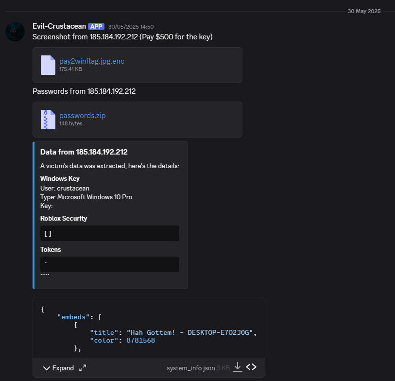
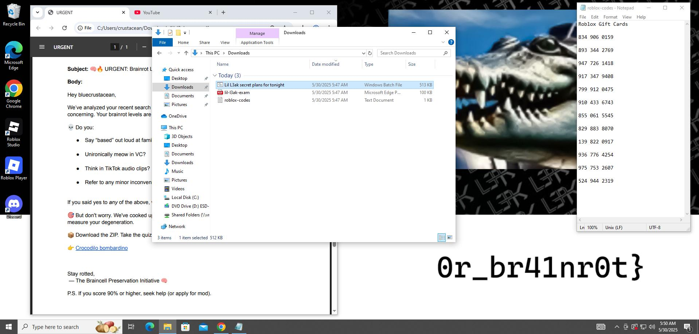

# 🐊 BOMbardino crocodile — L3AK CTF 2025 (FORENSICS)

[← Back to L3AK CTF 2025](ctf-l3ak-2025.md)

Category: Forensics

Points: 50

Author: warlocksmurf

## Summary

APT Lobster made their first confirmed intrusion on a machine in our network. Before the system was isolated, the attacker sent an outbound email — our job was to investigate what was sent and extract the flag, which consists of two parts.

We were given:
- A Windows filesystem image (with user crustacean)
- An .eml email file, partially Base64 encoded

Handout: [Google Drive link](https://drive.google.com/file/d/1i8oVitzdK9RKbzbTrFgkw5ZjM7YU1SJx/view?usp=drive_link)

### Part 2: The Email

Inside the .eml file was an HTML email. After decoding the base64 and parsing the HTML, we recovered a message that included a Discord invite: https://discord.gg/a7SUtZXaP4

Joining this led us to a server called LobsterLeaks, where several clues and download links were shared.

### Leak Script

We found a pythong file C:\Users\Public\Document\Lib\leak.py, with a heavily obfuscated with reversed base64:

_ = lambda __ : __import__('base64').b64decode(__[::-1])
exec((_)(b'VERY LOONG REVERSED BASE64 HERE'))

After decoding, it revealed a data exfiltration script. In the script was the password for the enc file, in the discord server:

    tralalero_tralala

Part 2:

    0r_br41nr0t}

### Part 1: Cursed bat files

Back in WindowsSecure.bat (placed in Startup folder), we found one of the key puzzles.

By applying the mapping, filtering out junk, and decoding it, we recovered flag part 1.

Part 1:

    L3AK{Br40d0_st34L3r_

## ✅ Final Flag

L3AK{Br40d0_st34L3r_0r_br41nr0t}
