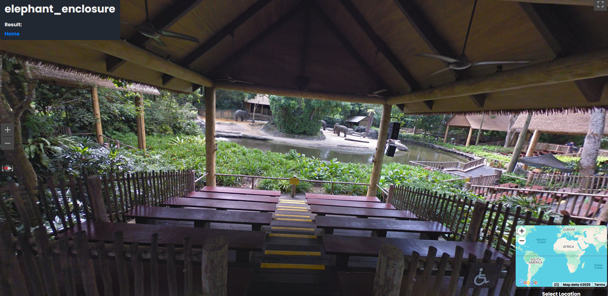

# 🐘 Elephant Enclosure — L3AK CTF 2025 (OSINT)

[← Back to L3AK CTF 2025](ctf-l3ak-2025.md)

Category: OSINT

Points: 50

Author: Suvoni, 0x157

## Summary

We were given a photo of an elephant enclosure and asked to locate its exact geographic coordinates. From there, we would uncover the flag.

## Investigation

Using a reverse image search on the provided photo, we identified the location as the elephant enclosure at the Singapore Zoo.

We cross-referenced the enclosure's structure with the [official Singapore Zoo map (PDF)](https://www.mandai.com/content/dam/mandai/singapore-zoo/park-map/sz-en-map.pdf). By comparing it to satellite imagery, we were able to pinpoint the enclosure on Google Maps:

📍 [View on Google Maps](https://maps.app.goo.gl/5Zyc2WwAMmimxjii9)

Coordinates

    1.4053762205056677, 103.79610301648137

## ✅ Final Flag

    L3AK{E13ph4nTs_4R3_F4sT_AF_https://youtu.be/ccxNteEogrg}