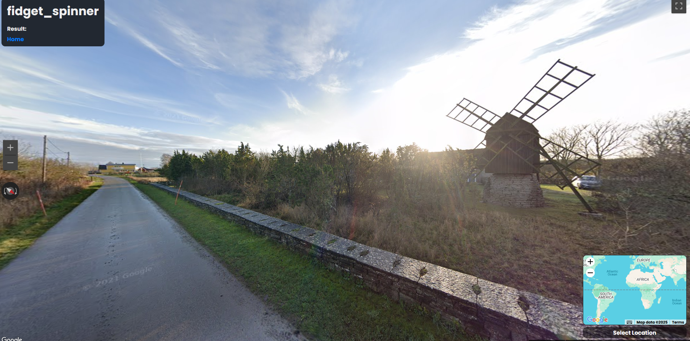

# 🌀 Fidget Spinner — L3AK CTF 2025 (OSINT)

[← Back to L3AK CTF 2025](ctf-l3ak-2025.md)

Category: OSINT

Points: 0 (unsolved during CTF)

Author: Suvoni, 0x157

## Summary

This challenge provided a photo of a windmill in a snowy landscape. While we weren't able to fully solve it during the CTF, we gathered a substantial amount of information and got very close.

## Initial Investigation

We began analyzing visual clues in the image:

    Road sign: Yellow with a red border — typical for Sweden

    Snow marker: Tall, orange post on the roadside

    Architecture: Red-painted house, another Scandinavian hint

    Landscape: Open fields with a traditional windmill

From this, we strongly suspected the image was taken somewhere in Sweden, possibly on Öland or Gotland, both known for historic windmills.

Despite searching through Google Maps, satellite imagery, and street view across these islands, we couldn’t locate the exact match.

## Post-CTF Update

Sadly, our compass work misled us, and the road alignment didn’t match the photo. 💀

After the CTF ended, it turns out the windmill was listed on a [windmill database](https://milldatabase.org/mills/sweden-windmill-224ba7a5-d8cc-4a96-a3c6-9629768c32c9) all along.

The location was eventually identified at:

📍 [View on Google Maps](https://maps.app.goo.gl/yhak4YWe6qrACB2o9) not found while ctf was ongoing

Coordinates: 

    57.1249237, 16.9466817 (not discovered during CTF)

## ✅ Final Flag

    404 Not Found