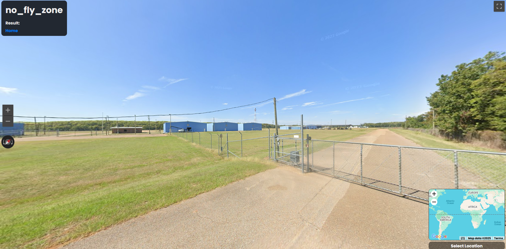

# ✈️ No Fly Zone(OSINT) - L3AK CTF 2025

[← Back to L3AK CTF 2025](ctf-l3ak-2025.md)

Category: OSINT

Points: 0 (unsolved during CTF)

Author: Suvoni, 0x157



## Summary

This challenge featured an airfield with a hangar and refueling truck. We weren't able to find the exact location before the CTF ended, but we developed some powerful tooling and a methodology that could prove invaluable in future challenges.

## Investigation

From the provided image, we observed:

    A refueling vehicle parked next to a hangar

    A radar tower in the background, but no visible control tower

    Architecture and surroundings reminiscent of small U.S. airstrips, likely in the Midwest

Based on this, we assumed the target was a public-use aerodrome without a control tower.
### Overpass Turbo Scripting

We crafted a custom query for [overpass-turbo](https://overpass-turbo.eu/) to filter for:

    Aerodromes with public access

    Runways nearby

    No nearby control tower

```
[out:json][timeout:25];

// Runways
(
  way["aeroway"="runway"]({{bbox}});
)->.runways;

// Aerodromes with public access, but no control tower nearby
(
  node["aeroway"="aerodrome"]["operator:type"="public"]({{bbox}});
  way["aeroway"="aerodrome"]["operator:type"="public"]({{bbox}});
  relation["aeroway"="aerodrome"]["operator:type"="public"]({{bbox}});
)->.aerodromes;

// Filter out aerodromes near a control tower
(
  node["aeroway"="control_tower"]({{bbox}});
)->.towers;

(
  node.aerodromes(around.runways:500);
  way.aerodromes(around.runways:500);
  relation.aerodromes(around.runways:500);
)->.likely_airports;

(
  node.likely_airports(around.towers:600);
  way.likely_airports(around.towers:600);
  relation.likely_airports(around.towers:600);
) -> .with_tower;

(.likely_airports; - .with_tower;);
out body;
>;
out skel qt;
```

This query alone yielded 43 hits in just one small region.

### Street View Data Filtering

We also used the website [geo.emily.bz](https://geo.emily.bz/coverage-dates) to identify where and when Google Street View had passed near U.S. airports. This let us:

    Filter airports with recent Street View coverage

    Cross-check the photo's timestamp with available Street View imagery

To process this data, we wrote a script:
📁 [filter-airports-by-streetview.py](../scripts/filter-airports-by-streetview.py)

We then merged this filtered dataset with the Overpass Turbo output and visualized the results using [gpx studio](https://gpx.studio/), allowing us to browse through a smaller, more relevant set of candidate locations.
Outcome

Despite narrowing the search area significantly, we ran out of time before locating the exact match. That said, we now have a solid workflow for future airfield-related OSINT challenges.

📍 [View on Google Maps]()

Coordinates:

    not found

## ✅ Final Flag

    not found
