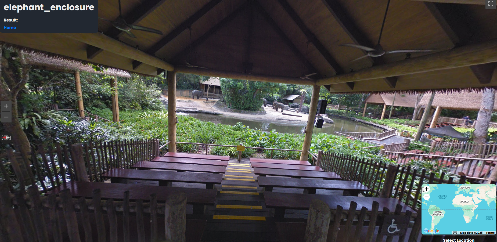

# Elephant Enclosure (OSINT) - L3AK CTF 2025

[← Back to L3AK CTF 2025](ctf-l3ak-2025.md)

Doing a image search showed it was the Singapore Zoo's elaphant enclosure. 
We decided to use a [zoo map](https://www.mandai.com/content/dam/mandai/singapore-zoo/park-map/sz-en-map.pdf) to locate it on satelite

[Place](https://maps.app.goo.gl/5Zyc2WwAMmimxjii9)

Coords: `1.4053762205056677, 103.79610301648137`

Flag: `L3AK{E13ph4nTs_4R3_F4sT_AF_https://youtu.be/ccxNteEogrg}`