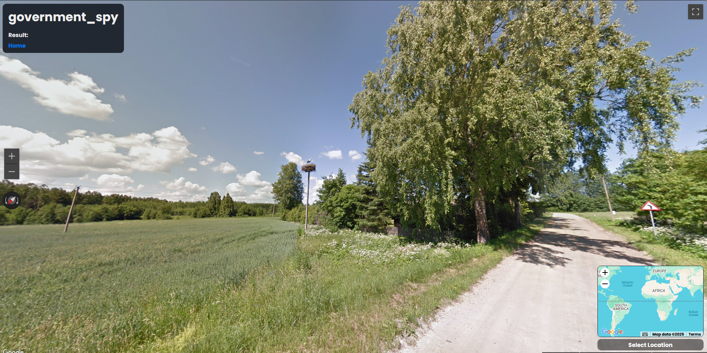

# Government Spy(OSINT) - L3AK CTF 2025

[← Back to L3AK CTF 2025](ctf-l3ak-2025.md)

We were never able to find this place, but we spend alot of time on this. So this will be a compilation of the information we where able to find on this.

At the side of the road there is some white flowers, commonly found in estonia. Combined with the turn left sign, matching the country we were pretty sure it was in that country.

There is also the obvious stork nest in the middle of the screenshot, and with that we found a [website tracking the stork nest locations](https://eoy.ee/valgetoonekurg/.

We considered using the overlapping technic with dates from the website and the database of stork nests. But never got around to it

[Place]() Not found

Coords: ``

Flag: `404 Not Found`