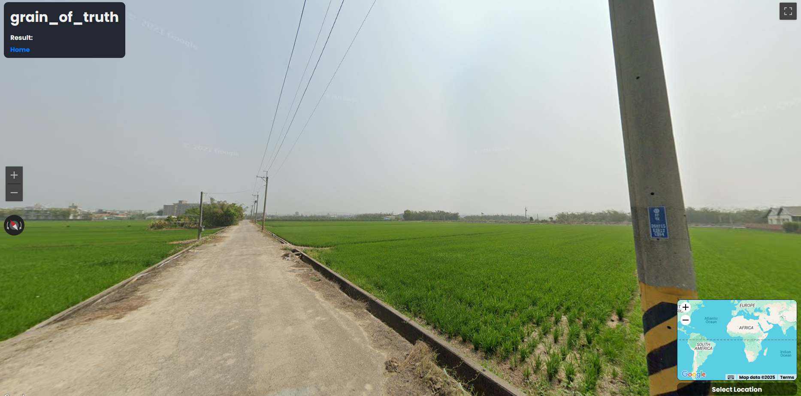

# Grain of truth (OSINT) - L3AK CTF 2025

[← Back to L3AK CTF 2025](ctf-l3ak-2025.md)

We are placed in a pretty bare landscape somewhere in asia. 
using [Plonkit](https://www.plonkit.net/taiwan#1) it has a whole geoguessr section on how to read the telephone pole numbers at the button of the sign.

[Place](https://maps.app.goo.gl/YeafRYgKzqGrPQvv7)

Coords: `23.555863243591038, 120.44644165279037`

Flag: `L3AK{Wh0_Kn3W_El3ctr1C_p0L3S_W3R3_so_Us3FuL!}`