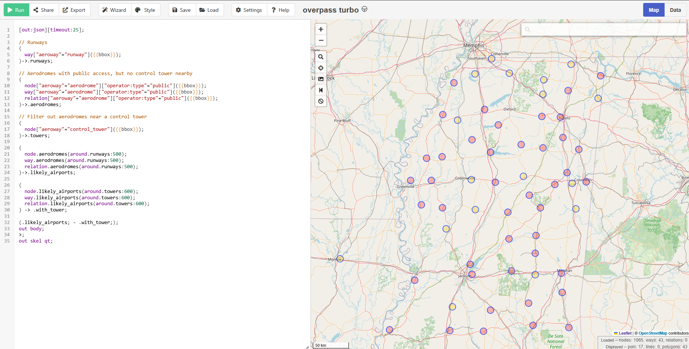

# No Fly Zone(OSINT) - L3AK CTF 2025

[← Back to L3AK CTF 2025](ctf-l3ak-2025.md)

We were never able to find this place, but we spend a lot of time on this. So this will be a compilation of the information we were able to find on this. Also, this challenge got us creating some pretty cool tools that could prove useful for future challenges.

The vehicle next to the hangar is used for refueling airplanes, so we were pretty confident this would be a small airstrip. 
And due to the hangers looking something straight out of an american action movie. We started out thinking this was in the midwest of the US. 
Using a tool called [overpass-turbo](https://overpass-turbo.eu/) which always you to compile scripts into files containing coordinates or gpx data. 
This data can be viewed on [gpx studio](https://gpx.studio/). This is important as this was our plan to get right location. 

In the background, we have a radar tower but no control tower in sight. So we created this overpass turbo script to sort with these parameters.

```
[out:json][timeout:25];

// Runways
(
  way["aeroway"="runway"]({{bbox}});
)->.runways;

// Aerodromes with public access, but no control tower nearby
(
  node["aeroway"="aerodrome"]["operator:type"="public"]({{bbox}});
  way["aeroway"="aerodrome"]["operator:type"="public"]({{bbox}});
  relation["aeroway"="aerodrome"]["operator:type"="public"]({{bbox}});
)->.aerodromes;

// Filter out aerodromes near a control tower
(
  node["aeroway"="control_tower"]({{bbox}});
)->.towers;

(
  node.aerodromes(around.runways:500);
  way.aerodromes(around.runways:500);
  relation.aerodromes(around.runways:500);
)->.likely_airports;

(
  node.likely_airports(around.towers:600);
  way.likely_airports(around.towers:600);
  relation.likely_airports(around.towers:600);
) -> .with_tower;

(.likely_airports; - .with_tower;);
out body;
>;
out skel qt;
```

this gives the following output in overpass-turbo, just alone in this small area we already have 43 entries. 



We also found a [website](https://geo.emily.bz/coverage-dates) containing information on when the goggle street car had been in specific areas. This allowed us to use the date on the google street picture and the coord of airports. and take all airports which the google street has been close to and output that. Which would heavily limit what we had to search through.

We made a script( [filter-street-data-to-geojson.py](scripts/filter-street-data-to-geojson.py) ) to convert this streetview data into something we could use. 

With the 2 data sets, we took the points withing a certain radius. And combined them into 1 set of gpx cords we could sort through.  


[Place]()

Coords: ``

Flag: `404 Not Found`